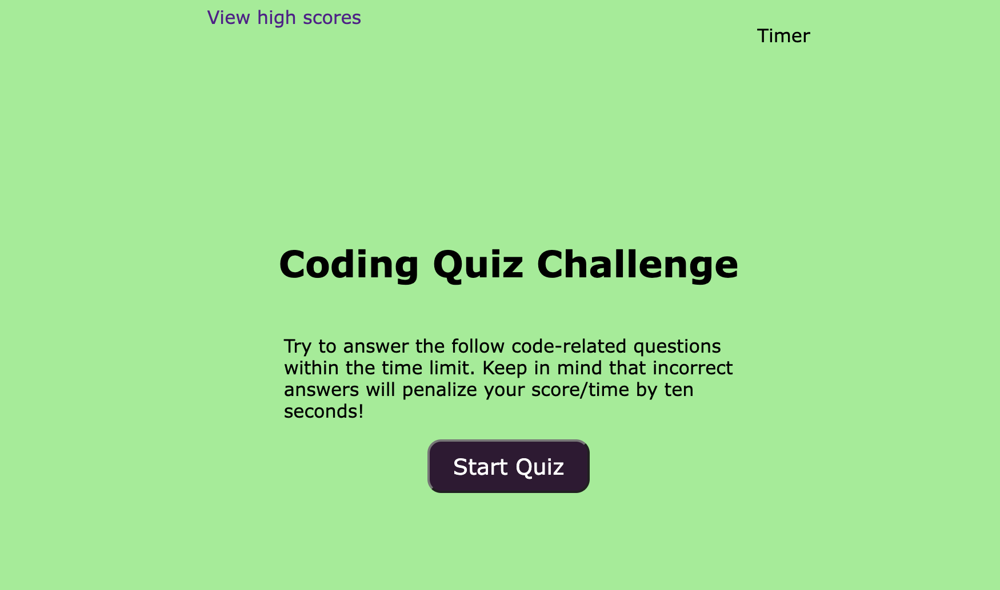

# Timed Code Quiz

## Description
This timed code quiz consists of a series of five multiple choice questions related to the JavaScript language. When a question is answered correctly, one point is added to the score, and when a question is answered incorrectly, ten seconds is subtracted from the clock. The user can choose to input their initials to save their score.

## Built With 
* HTML
* CSS
* JavaScript

## Link to Deployed Application 
https://osamadahnoun.github.io/Timed-Code-Quiz/#

## Screenshot of Deployed Application

## Contribution
Timed-Code-Quiz created and designed with ❤️ by Osama Dahnoun